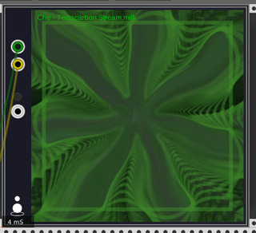

# Milkrack

Milkrack brings [Winamp](https://www.winamp.com/)'s Old Skool Cool
visualizations from [Milkdrop](http://www.geisswerks.com/milkdrop/)
into your [VCV Rack](https://vcvrack.com)). Powered by
[ProjectM](https://github.com/projectM-visualizer/projectm).

Just spawn the "Milkrack - embedded" module and wire its left input to
your mixer's output., and you should see something like this:



## Usage

The module comes in 2 flavors:

* Embedded, showing the cool visuals directly on the module.
* Windowed, rendering visualizations to a separate window.

Both flavors have the same inputs and params:

* 2 stereo audio inputs. They're normalized to the left, so you can
  send mono signals to just the left side.
* 1 "next preset" button and 1 "next preset" trigger input. These
  change the Milkdrop preset being rendered.

Non-audio signals as inputs may not give great results depending on
the preset in use, as the visualization presets expect actual sound to
detect BPM and perform a Fourier transform on.

The right-click menu allows you to enable automatic preset rotation,
or to select a specific preset to use.

### Windowed mode key shortcuts

When using the windowed flavor of the module, the visuals are rendered
to a separate window. That window will react to certain shortcuts:

* `F`, `F4` or `Enter` will toggle full screen mode;
* `Escape` and `Q` will exit full screen mode, or, when not in full
  screen, will minimize the window;
* `R` will switch to a new preset.

Note that the window cannot be closed. To remove the window, simply
delete the module in Rack.

### OSX compatibility notes

When running under OSX, due to OpenGL incompatibilities, the Embedded
flavor won't work. It's not possible to render Milkdrop presets in a
window owned by VCV Rack, the OpenGL versions are not
compatible. Consider using the windowed flavor instead.

## Building

* Install the GLM lib and OpenGL ES development headers, as well as autotools.
  * `apt install autoconf libtool libglm-dev libgles2-mesa-dev libgl1-mesa-dev` on Debian systems
  * `brew install glm automate libtool pkg-config` on OSX
  * If you figure out how to build this on Windows, please let me know! I don't have access to a Windows machine myself.
* Git clone Milkrack under your `plugins` directory
* `git submodule init` and `git submodule update`
* `(cd src/deps/projectm && git apply ../projectm*.diff)`
* `(cd src/deps/projectm && ./autogen.sh && ./configure --with-pic --enable-static --enable-gles --disable-threading && make)`
  to build projectM
* `make` Milkrack itself

## Troubleshooting

### no matching function for call to `min(float, error)'

If you're getting this kind of errors:

```
Failed to link program: error: linking with uncompiled shader
Failed to compile shader 'Fragment: blur2'. Error: 0:30(62): error: could not implicitly convert operands to arithmetic operator
0:30(12): error: no matching function for call to `min(float, error)'; candidates are:
0:30(12): error:    float min(float, float)
(...)
Failed to link program: error: linking with uncompiled shader
```

Try applying the patch under `src/deps` to projectM. Just
`cd src/deps/projectm` and `git apply ../projectm*.diff`.

### version '300' is not supported

If you encounter errors such as:

```
Failed to compile shader 'Vertex: v2f_c4f'. Error: ERROR: 0:1: '' :  version '300' is not supported
ERROR: 0:1: '' : syntax error: #version
ERROR: 0:2: 'layout' : syntax error: syntax error
```

or others like those found in issue #2, this is due to a version
incompatibility between OpenGL, OSX, projectM and Rack. It's not clear
whether there's a solution, and we don't have the knowledge or the
resources to fix it (no access to an OSX dev box). If you have a Mac
and you know something about OpenGL, please contribute to issue #2.

### The visualization window is black/shows a scaled down version of my Rack

If your window is just black, make sure you're sending sound into the
module. No signal or non-audio signals may not trigger the preset to
render anything.

If you're running OSX, the embedded flavor of the module won't work
due to OpenGL version conflicts. Use the windowed mode.

If you are actually sending audio into the module, this is a sign that
your shaders didn't compile. Check the standard output of Rack for
errors related to invalid shaders and refer to the other
troubleshooting options in this README to find matching errors.

Check that you configured the projectM build with `--enable-gles`.

### The visualization only shows some floating W letters with headphones

This happens if Milkrack didn't find any Milkdrop presets to load. If
you built the plugin yourself make sure that the `presets` folder got
included in the zip file. If you downloaded the plugin from this
repository's release or from the VCV plugin store, please file an
issue explaining your problem.

### The plugin crashed my Rack!

We've done extensive testing to try to prevent this, but if this
happens to you, please
[file an issue](https://github.com/korfuri/Milkrack/issues/new)
telling us what software you're running (Rack version, Milkrack
version, OS), what you were doing, what happened, and attack Rack's
log.txt and if possible Rack's standard output.

## License

This plugin is released under LGPL.
